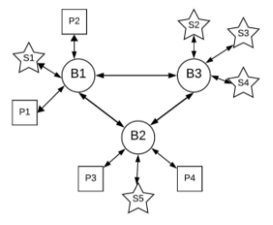

COMP90015: Semester 2, 2024
Assignment 2: Distributed Publisher-Subscriber System

Release date: September 10, 2024

Due date: No later than 5 pm, October 13, 2024 AEDT

Weight: 25% of the finalmark

1 Objective

Publisher-subscriber (pub-sub) systems are a widely used architectural pattern in distributed systems, offering benefits such as decoupling of components, scalability, and real-time communication. These systems allow pub- lishers to send messages on various topics without needing to know the subscribers, who can receive updates on topics they are interested in without being aware of the publishers. In this assignment, you will develop a simplified distributed publisher-subscriber (pub-sub) system using a broker network, implemented with socket programming or RMI. The system should allow publishers and subscribers to interact with the broker network seamlessly, supporting multiple topics and facilitating real-time message distribution.

2 System Specifications(20 Marks)

The system is comprised of three main components:

- Brokers: A network of three interconnected broker nodes (e.g., B1, B2, and B3 in Figure 1) that manage topics, subscriptions, and message distribution.
- Publishers: Clients (e.g., P1, P2, P3, and P4 in Figure 1) that create topics and publish messages to the system.
- Subscribers: Clients (e.g., S1, S2, S3, S4, and S5 in Figure 1) that subscribe to topics and receive messages in real time.

Figure 1: Publish-Subscribe System

Figure[ 1 ](#_page0_x265.14_y741.81)illustrates the distributed publisher-subscriber (pub-sub) system architecture for this project. Each com- ponent operates independently, with brokers handling communication and synchronization across the network. Publishers and subscribers interact only with the broker to which they are connected.

1. Broker Network
- The brokers are central to the system, handling both the publishing and subscription processes. Brokers are interconnected and they manage topic creation, topic lists, subscriber lists, and message routing.
- The system should consist of exactly three broker nodes as shown in Figure[ 1,](#_page0_x265.14_y741.81) where each broker should be running on a predefineddistinct port number.
- Brokers are always ready for new publishers and subscribers to join the network. Each broker must be able to handle multiple publishers and subscribers that are connected to it.
- Once a publisher publishes a message, that message must be delivered via the broker network to all sub- scribers who have expressed interest in that topic.
- Each broker only storesits ownlocal publisher and subscriber connectivity (e.g. sockets) information.
- You can store any state/data of your choice within the brokers (except for connection information of pub- lishers/subscribers from other brokers, as mentioned above). This data can be either ‘partial and local’ to each broker or ‘complete and shared globally’ across all brokers.
2. Publisher
- Publishers are clients that create topics and publish messages to the system through one of the brokers. They send messages related to specifictopics to their connected broker.
- A publisher can connect to only one broker at a time, specifiedvia the command line at runtime.
- Publishers can perform the following operations via a console-based menu (see Section 4 for more details):
1. Create a New Topic: Generates a unique topic ID (e.g., UUID) and assigns a name (not necessarily unique as multiple publishers may have topics with the same name).
1. Publish a Message to an Existing Topic: Sends a message of a topic through its broker by using the unique topic ID. The message should be sent to all topic subscribers. Each message will be limited to a maximum of 100 characters. It is not required to persist messages in any of the brokers.
1. Show Subscriber Count: Shows the total number of subscribers for each topic associated with this publisher.
1. Delete a Topic: Removes the topic from the system and automatically unsubscribes all current sub- scribers. A notificationmessage should is sent to each subscriber.
- Publishers can maintain multiple topics at the same time, but can only send one message at a time to any of their topics via the console-based menu.
- There can be up to 5 publishers present in the system at the same time.
- You may assume that publisher names will be unique throughout the system.
3. Subscriber
- Subscribers are clients that express interest in specifictopics by subscribing to them through a broker. They receive real-time messages on those topics from their broker.
- A subscriber can connect to only one broker at a time, specifiedvia the command line at runtime.
- Subscribers may subscribe to multiple topics (from the same or different publishers).
- Subscriberscan perform the followingoperations via a console-based menu (see Section 4 for more details):
1. ListAllAvailableTopics: Retrievesthelistofallavailabletopicsacrossthebrokernetwork,including topic ID, topic name, and publisher name.
1. Subscribe to a Topic: Subscribes to a topic using the topic’s unique ID. The subscriber will receive all future messages published on this topic.
1. Show current subscriptions: Lists the active subscriptions with topic ID, topic name, and publisher name.
1. Unsubscribe from a Topic: Stops receiving messages from a topic. The broker sends a notification message confirmingthe unsubscription.
- When a message is published to a subscribed topic, it is immediately displayed on the subscribers console along with the topic ID, topic name, and publisher name.
- A subscriber should receive a real-time notification message if they unsubscribe from a topic or if a topic they are subscribed to is deleted by the publisher.
- There can be up to 10 subscribers present in the system at the same time.
- You may assume that subscriber names will be unique throughout the system.
4. Communication
- When a publisher sends a message on a particular topic to its connected broker, the broker handles the distribution. The message is delivered to all subscribers of that topic, even if they are connected to a different broker in the network.
- Brokers (B1, B2, B3) can communicate with each other to synchronize/share information. This inter- broker communication ensures that a subscriber connected to one broker can receive messages from topics published through other brokers.
- For example, if a message is published to B1, and subscribers on B3 are interested in that topic, the message is delivered from B1 to B3 and then to the subscribers to ensure the message is delivered to the appropriate subscribers.
5. Fault Tolerance

You may assume that the broker nodes in the network do not crash. You may also assume that the underlying network is reliable and messages will not be lost. However, the publishers/subscribers may crash. If a publisher crashes, all its topics should be automatically deleted from the broker network and all of its subscribers should be unsubscribed. If a subscriber crashes, its subscriptions (if any) should be removed automatically.

3 Design Considerations

- Sockets vs RMI: The connection between related nodes (e.g., between one broker to another broker, or between a broker and its publishers/subscribers) should be established with either Java sockets or RMI, based on your chosen implementation approach. If you use RMI, you must design your remote interface(s) and servants.
- Dealing with concurrency: Regardless of the technology chosen, you must ensure that access to shared resources/state is properly handled and that simultaneous actions lead to a reasonable state.
- Dealing with networked communication: You must decide when/what data gets sent across the network. You may have to design an exchange protocol that establishes which messages are sent in which situation and the replies that they should generate. You should decide how a message is routed from the publisher to its subscribers through the broker network.
- Console I/O: All interactions with publishers and subscribers will be conducted through a console-based interface. Please refer to the Section[ 4 ](#_page3_x72.00_y72.00)for details. Brokers do not require any input/output display, though you may print broker logs for your use and debugging purposes.

4 Console Interface

Terminal/Console input arguments are represented by the curly brackets f g. The output variables are represented by the square brackets [ ]. The actual input and output should not include these brackets. The real-time message printout with date and time, topic ID and topic title, and real-time message:

[dd/mm hh:mm:ss] [topic\_id:topic\_name:] [message]

If not specified, the output should indicate the status after the command execution, such as success or error, and the corresponding exception:

[success] or [error] [exception]

1. Publisher

Publisher’s console commands should include at least the following 4 commands::

Please select command: create, publish, show, delete.

1. create {topic\_id} {topic\_name} #create a new topic
1. publish {topic\_id} {message} # publish a message to an existing topic
1. show {topic\_id} #show subsriber count for current publisher [topic\_id\_1] [topic\_name\_1] [count\_1]

[topic\_id\_2] [topic\_name\_2] [count\_2]

... ... ...

4. delete {topic\_id} #delete a topic
2. Subscriber

Subscriber’s console commands should include at least the following 4 commands:

Please select command: list, sub, current, unsub.

1. list {all} #list all topics

[topic\_id\_1] [topic\_name\_1] [publisher\_1]

[topic\_id\_2] [topic\_name\_2] [publisher\_1]

[topic\_id\_3] [topic\_name\_3] [publisher\_2]

... ... ...

2. sub {topic\_id} #subsribe to a topic
2. current # show the current subscriptions of the subsriber [topic\_id\_1] [topic\_name\_1] [publisher\_1]

[topic\_id\_2] [topic\_name\_2] [publisher\_2]

... ... ...

4. unsub {topic\_id} #unsubsribe from a topic

5 Deployment

- Separate JAR filesshould be created for each component: broker, publisher, and subscriber.
- Broker: Each broker must be started separately using the broker program’s jar file. Brokers should be initiated first, before any publishers or subscribers. Each broker should be started with a predefined port number, and if available, the IP addresses and port numbers of other brokers. Brokers must always accept new connection requests from additional brokers in the system. If [IP:port] pairs of other brokers are pro- vided in the command-line arguments, the broker should attempt to establish connections with those brokers based on the specified [IP:port] pairs. You may choose to use a dedicated port for each broker to handle publisher/subscriber connections, and another separate port for inter-broker connections.
- Publisher/Subscriber: Started with one broker’s IP address and port number specified via command-line arguments. For details, refer to the submission requirements (Section [7).](#_page4_x72.00_y415.95)
- For testing purposes you may use localhost as your IP address so that the system can be run and tested on a single machine.

6 Report (5 Marks)

You should write a report describing your system and discussing your design choices. Your report should include:

- An overall class design and an interaction diagram
- A brief description of the components of the system
- A critical analysis of the work completed, including design choices and their justifications.

Please note that the report is a written document, so do not put only graphs/figures. Additionally, you should not include any screenshots or sample execution steps from your project runs. A report without any descriptive text addressing the problem, architecture, protocols, and analysis of the work done will not be considered valid. The length of the report is not fixed. A good report is auto-consistent and contains all the required information for understanding and evaluating the work done. Given the level of complexity of the assignment, a report in the range of 6 to 8 pages is reasonable. Please note that the length of the report is simply a guideline to help you avoid writing an extremely long or incomplete report.

It is important to put your details (name, surname, student id):

- On the firstpage of the report
- As a header in each of the filesof the software project

This will help to avoid any mistakes in locating the assignment and its components on both sides.

7 Submission

You need to submit the following via LMS:

- Your report in PDF format only
- The three executable jar files used to run your system’s brokers (server), publisher, and subscriber. The executable jar files should run the following way (and must handle the command-line arguments shown below). Note that, if you complete the bonus features, the command arguments and executable jar can differ from the standard submission requirements. If applicable, broker.jar will use -b flagto indicate other broker [IP:port] pairs. Note that, if you use RMI, you may want to indicate RMI Registry IP and port number as well in the arguments of jars.

  java -jar broker.jar port -b [broker\_ip\_1:port1 broker\_ip\_2:port2] java -jar publisher.jar username borker\_ip broker\_port

  java -jar subscriber.jar username borker\_ip broker\_port

- Your source filesin a .ZIP or .TAR archive only
- Note: Failure to comply with the submission criteria (file type, command-line args for running jars, etc.) will result in a 4 mark deduction.
- Late Submission Penalties: -1 mark for each day

8 Testing Tips

- Conduct rigorous testing to validate the functionality and stability of your distributed publish-subscribe system across various scenarios. These should include situations where multiple topics are published at the same time.
- Payparticularattentiontosynchronizationandconcurrencyissues,ensuringthatthesystemoperatessmoothly.
- Check if the subscribers receive accurate and timely messages from their publishers as expected.
- Simulate broker network functionality in various scenarios, e.g. publishers and subscribers allocated within the same broker or across different brokers.
- \*\*\*Important Note: There will be no partial credit for attempts to implement a feature. Marks will be awarded solely based on the correct functionality of the system. Additionally, no marks will be given for a feature if the "distributed" aspect (e.g., broker network) is not properly utilized.

9 Bonus Task: Dynamic Broker Discovery (3 Marks)

The 3 Bonus marks can be achieved in addition to the total score of 25 Marks.

- Directory Service: Implement a central directory service that is known to all publishers, subscribers, and brokers beforehand. This service will act as a registry where brokers can register themselves upon startup.
- Broker Registration: When a broker starts, it registers its IP address and port number with the directory service. The directory service maintains an up-to-date list of all active brokers.
- Publisher/Subscriber Connection: Publishers and subscribers query the directory service to discover available brokers and connect to one of them. This allows for dynamic connection management without the need for hard-coded broker information.
- Broker Interconnection: When a new broker registers with the directory service, the directory service provides it with the list of currently active brokers. The new broker then establishes connections with the existing brokers, ensuring it is fully integrated into the broker network.

10 Demonstration Schedule and Venue

You are required to provide a demonstration of the working application and will have the opportunity to discuss with the tutors the design and implementation choices made during the demo. You are free to develop your system where you are more comfortable (at home, on one PC, on your laptop, or in the labs...) but keep in mind that the assignment is meant to be a distributed system that works on at least two different machines to separate the clients from the server. We will announce the demo date, time, and venue closer to the due date. Each tutor will hold 2-3 demo sessions and you will be required to showcase your system in one of the sessions held by the tutor of the workshop in which you are enrolled. If you need any clarificationon the assignment, kindly ask questions during the tutorials or in the Ed forum, so that all students benefitfrom it. NOTE: The demo is going to be campus-based, and we will announce the demo schedule. Note that a mark deduction will be applied if you miss a registered demo or ask to reschedule without a valid reason.

11 Collaboration and Plagiarism

You may discuss this assignment abstractly with your classmates but what gets typed into your program must be individual work, not copied from anyone else. Do not share your code and do not ask others to give you their programs. Do not post your code on the subject’s discussion board Ed. The best way to help your friends in this regard is to say a very firm“no” if they ask to see your program, pointing out that your “no”, and their acceptance of that decision are the only way to preserve your friendship. See[ https://academicintegrity.unimelb.](https://academicintegrity.unimelb.edu.au)

[edu.au ](https://academicintegrity.unimelb.edu.au)for more information.

Note also that solicitation of solutions via posts to online forums, whether or not there is payment involved, is also an Academic Misconduct. You should not post your code to any public location (e.g., GitHub) while the assignment is active or before the release of the assignment marks.

If you use any code not written by you, you must attribute that code to the source you got it from (e.g., a book or Stack Exchange).

Plagiarism policy: You are reminded that all submitted project work in this subject should be your own work. Automated similarity-checking software will be used to compare submissions. It is the University’s policy that cheating by students in any form is not permitted and that work submitted for assessment purposes must be the independent work of the student concerned.

Using git may help you with the verificationof authorship later.

Good luck!

"A distributed system is one in which the failure of a computer you didn’t even know existed can render your own computer unusable!" - Leslie Lamport[^1]
7

[^1]: <https://amturing.acm.org/award_winners/lamport_1205376.cfm>